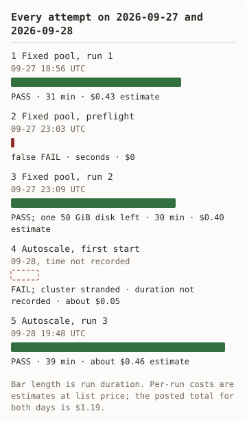
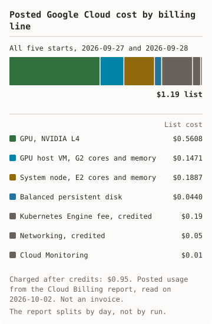

# nim-gke

**NVIDIA NIM inference on Google Kubernetes Engine, on a single L4 GPU**

Shell scripts that deploy an NVIDIA NIM LLM microservice on GKE with NVIDIA's
Helm chart, send it requests, then delete everything and check that nothing
is left. The project is a smoke-test harness, not a production platform.

Three runs have been measured end to end: two with a fixed GPU pool and one
with GPU node autoscaling 0→1→0 on one L4. See
[run 1](docs/runs/2026-09-27-run-1-fixed.md),
[run 2](docs/runs/2026-09-27-run-2-fixed.md), and
[run 3](docs/runs/2026-09-28-run-3-autoscale.md) for every measured number in
this file.

**Based on**: [Google Codelabs - Deploy an AI model on GKE with NVIDIA NIM](https://codelabs.developers.google.com/codelabs/nvidia-nim-google-cloud)

## Status

- **Measured runs, fixed GPU pool:** 2026-09-27: two runs. Deploy and benchmark PASS in both. Run 2's destroy left one disk; the fix is proven in run 3.
- **Measured run, autoscaling 0 to 1 to 0:** 2026-09-28: PASS, once, on one L4. Scale-up in 1 m 17 s, scale-down in 12 m 32 s, destroy clean.
- **Posted cost:** Cloud Billing report read on 2026-10-02: $1.19 at list cost for every start, $0.95 charged.
- **Failed starts:** Two, plus run 2's failed destroy. The [attempt log](docs/runs/README.md#every-attempt-including-the-failures) lists each with its cause and fix.
- **Not measured:** `deploy_nim_production.sh`, a second GPU node, any GPU other than the L4.
- **CI:** Shellcheck, stubbed tests of the runner, cleanup, and autoscale paths, YAML lint, link check.

## Measured results

Three runs in project `nim-on-gke`, `us-central1-a`, chart `nim-llm-1.3.0`,
image `nvcr.io/nim/meta/llama3-8b-instruct:1.0.0`, backend profile
`vllm-fp16-tp1`. The per-run tables are in [docs/runs/](docs/runs/README.md).

<picture><source media="(prefers-color-scheme: dark)" srcset="docs/diagrams/measured-dark.svg"/></picture> <picture><source media="(prefers-color-scheme: dark)" srcset="docs/diagrams/attempts-dark.svg"/></picture>

<details><summary>Text version of the charts</summary>

Scale-up 385 s on OKE and 77 s on GKE. Scale-down 312 s on OKE with timers set to 3 minutes and 752 s on GKE with the default delay. Script start to NIM Ready with autoscale 23 min 04 s on OKE and 16 min 07 s on GKE. Posted list cost for every start $1.17 on OKE and $1.19 on GKE.

Five starts. 09-27 18:56 fixed pool run 1 passed in 31 minutes. 09-27 23:03 preflight gave a false fail. 09-27 23:09 fixed pool run 2 passed in 30 minutes and left one 50 GiB disk. 09-28 the first autoscale start failed and stranded a cluster. 09-28 19:48 autoscale run 3 passed in 39 minutes.

</details>

<details><summary>Notes on the figures</summary>

- The estimates use list prices and upper-bound durations. The posted cost is
  from the Cloud Billing report, read on 2026-10-02. The report splits by
  day, not by run. [docs/runs/README.md](docs/runs/README.md) has every line.
- The estimates were high, as upper bounds should be: $0.83 estimated against
  about $0.70 posted for 2026-09-27.
- Run 2 used the scripts after the review fixes. Its orphaned disk came from
  deleting the cluster before the volume. `cleanup.sh` now waits for each
  volume, and run 3 proves it.
- In run 3 the GPU node sat idle for the 12 m 32 s scale-down wait. That wait
  is GKE's own delay and is the price of scale-to-zero here.
- Twenty requests on one stream is a smoke test, not a load test.
- 1→2 (`--two-nodes`) needs GPU quota 2 and is not measured.
  `deploy_nim_production.sh` remains unmeasured.

</details>

The per-run figures are in [docs/runs/](docs/runs/README.md); the rates in
the [reference](docs/reference.md#cost).

## What it deploys

<picture><source media="(prefers-color-scheme: dark)" srcset="docs/diagrams/deploys-dark.svg"/></picture> <picture><source media="(prefers-color-scheme: dark)" srcset="docs/diagrams/cost-dark.svg"/></picture>

NIM container → L4 GPU → GKE node pool. NIM picks a backend profile at startup for the detected GPU; on the L4 it found one compatible profile, `vllm-fp16-tp1` (vLLM, FP16), per the [run 2 pod log](docs/runs/2026-09-27-run-2-fixed.md#backend-profile).

<details><summary>Text version of the charts, components, and hardware support</summary>

A client (curl or an OpenAI SDK) calls the NIM pod over the OpenAI-compatible API. The NIM pod runs `llama3-8b-instruct` 1.0.0 with backend profile `vllm-fp16-tp1`. It pulls its image from the NGC registry and keeps model files on a 50 GiB persistent disk. It is scheduled on one GPU node, `g2-standard-4` with one NVIDIA L4. With `AUTOSCALE=1`, the GKE cluster autoscaler adds and removes that node. The pod, disk, GPU node, and autoscaler sit inside the GKE cluster in `us-central1-a`.

Posted list cost $1.19 for five starts: L4 GPU $0.5608, G2 host VM $0.1471, E2 system node $0.1887, persistent disk $0.0440, Kubernetes Engine fee $0.19 credited, networking $0.05 credited, Cloud Monitoring $0.01. Charged after credits $0.95.

**Components**:
- **Model**: Meta Llama 3 8B Instruct
- **Runtime**: NVIDIA NIM, image `nvcr.io/nim/meta/llama3-8b-instruct:1.0.0`
- **Chart**: `nim-llm` 1.3.0 (fetched at deploy time; not committed to the repo)
- **Orchestration**: Kubernetes StatefulSet via Helm
- **Compute (measured path, `deploy_nim_gke.sh`)**: one `g2-standard-4` node
  with one NVIDIA L4, plus one `e2-standard-4` system node. Fixed node
  counts by default. With `AUTOSCALE=1` the GPU pool starts at 0 nodes and
  autoscales to 1; run 3 measured that path.
- **Compute (unmeasured path, `deploy_nim_production.sh`)**: GPU node pool
  autoscales 0-2 nodes; system pool has a minimum of 1 node.
- **API**: OpenAI-compatible REST (`/v1/chat/completions`)

#### Hardware support

NVIDIA's current NIM support matrix lists `llama-3.1-8b-instruct`, and no row
lists the NVIDIA L4 (checked 2026-09-27:
https://docs.nvidia.com/nim/large-language-models/latest/reference/support-matrix.html).
This repo runs the earlier `llama3-8b-instruct:1.0.0` image on one L4; it is
off the current matrix and measured working (see the
[run 1 receipt](docs/runs/2026-09-27-run-1-fixed.md)). Newer chart and image
versions are not yet tested here.

</details>

## Quick start

- `gcloud` CLI, Latest: GCP authentication, cluster management
- `kubectl`, 1.28+: Kubernetes operations
- `helm`, 3.0+: Chart deployment
- NGC API Key: NIM image registry auth
- GCP Project: Billing enabled
- GPU Quota, 1× L4: us-central1 or compatible region

**GPU quota approval**: Required before deployment. See `/docs/GPU_QUOTA_GUIDE.md`.

`NGC_API_KEY` is the variable the `nim-llm` chart and NVIDIA's docs use
(https://docs.nvidia.com/nim/large-language-models/latest/deployment/kubernetes-deployment/helm-k8s.html).
`NGC_CLI_API_KEY` is still accepted as a fallback if `NGC_API_KEY` is unset.

```bash
# 1. Set the two required variables.
export NGC_API_KEY='your-key-here'
export PROJECT_ID='your-gcp-project'

# 2. Run the preflight checks.
#    Read-only.
./scripts/preflight.sh

# 3. Deploy.
./scripts/deploy_nim_gke.sh

# 4. Verify the pod.
kubectl get pods -n nim

# Forward the service port. It keeps
# running: use a second terminal.
kubectl port-forward -n nim \
  svc/my-nim-nim-llm 8000:8000

# 5. Test.
./scripts/test_nim.sh

# Or run the benchmark.
python3 scripts/bench.py

# 6. Tear down.
./scripts/cleanup.sh
```

All other settings (region, zone, cluster name, machine types, chart
version, release name, namespace) come from `scripts/config.env`. Override
any of them by exporting the variable before running a script.

The production path, `deploy_nim_production.sh`, is not measured; see
[operate](docs/operate.md#production-deployment-not-measured).

## Measured run

`scripts/run_measured.sh` runs the whole path once and records it: preflight,
deploy, wait for Ready, benchmark, cleanup, and a check that nothing is left.

<picture><source media="(prefers-color-scheme: dark)" srcset="docs/diagrams/autoscale-dark.svg"/></picture> <picture><source media="(prefers-color-scheme: dark)" srcset="docs/diagrams/runner-ends-dark.svg"/></picture>

<details><summary>Text version of the charts</summary>

The GPU node pool starts at 0 nodes. The NIM pod goes Pending and asks for one GPU. The GPU node is Ready 1 m 17 s later. NIM serves the benchmark, then replicas are set to 0. The pool is back at 0 nodes 12 m 32 s after that.

The runner sets a trap and arms a watchdog in its own session. The steps run: deploy and benchmark. Cleanup runs from the trap on every exit. When cleanup is confirmed, the runner exits with the cluster deleted. If the runner dies or the time limit passes, the watchdog runs cleanup. If cleanup cannot be confirmed, the runner prints the `gcloud` delete commands and leaves the watchdog armed.

</details>

Set the two required variables:

```bash
export PROJECT_ID='your-gcp-project'
export NGC_API_KEY='your-key-here'
```

Fixed pool:

```bash
scripts/run_measured.sh \
  /tmp/nim-run-fixed
```

Autoscale, 0 to 1 to 0:

```bash
scripts/run_measured.sh --autoscale \
  /tmp/nim-run-autoscale
```

Scope: one GPU node, measured once, in
[run 3](docs/runs/2026-09-28-run-3-autoscale.md). The runner ends with the
cluster deleted, or leaves the watchdog armed and prints the delete
commands; details in
[docs/autoscaling-and-runner.md](docs/autoscaling-and-runner.md).

## Known gaps

- **Single GPU**: Multi-GPU tensor parallelism requires code changes
- **Model size**: Llama 3 8B fits L4. Larger models need A100/H100
- **Persistence**: Model cached on PV. Deletion triggers re-download
- **Regional availability**: L4 not in all GCP zones
- **Repeatability**: two fixed-pool runs and one autoscale run. That is not a repeatability result
- **Cost by run**: Google's billing report splits by day, so runs 1 and 2 share one posted figure
- **Off support matrix**: see [Hardware support](#hardware-support) above

## More

- [GKE compared with OKE](docs/compared-with-oke.md), with the measured runs side by side.
- [Operate](docs/operate.md): verify, monitor, scale, cost control, troubleshoot, production path.
- [Reference](docs/reference.md): cost rates, prerequisites, configuration, security, what this adds, layout, references.
- [Quick start](docs/QUICKSTART.md), [production guide](docs/PRODUCTION_GUIDE.md), [GPU quota guide](docs/GPU_QUOTA_GUIDE.md).
- [Receipts and every attempt](docs/runs/README.md).

## License

Provided as-is for educational and reference purposes. NVIDIA NIM requires acceptance of NVIDIA AI Enterprise EULA.

---

**Last measured**: 2026-09-28. See [run 1](docs/runs/2026-09-27-run-1-fixed.md),
[run 2](docs/runs/2026-09-27-run-2-fixed.md), and
[run 3](docs/runs/2026-09-28-run-3-autoscale.md).
