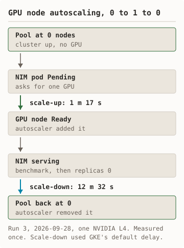
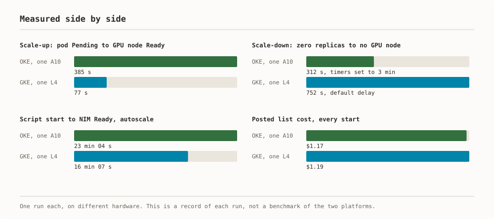

# nim-gke

**NVIDIA NIM inference on Google Kubernetes Engine, on a single L4 GPU**

Shell scripts that deploy an NVIDIA NIM LLM microservice on GKE with NVIDIA's
Helm chart, send it requests, then delete everything and check that nothing
is left. The project is a smoke-test harness, not a production platform.

Three runs have been measured end to end: two with a fixed GPU pool and one
with GPU node autoscaling 0→1→0 on one L4. See
[run 1](docs/runs/2026-09-27-run-1-fixed.md),
[run 2](docs/runs/2026-09-27-run-2-fixed.md), and
[run 3](docs/runs/2026-09-28-run-3-autoscale.md) for every measured number in
this file.

**Based on**: [Google Codelabs - Deploy an AI model on GKE with NVIDIA NIM](https://codelabs.developers.google.com/codelabs/nvidia-nim-google-cloud)

---

## Status

- **Measured runs, fixed GPU pool:** 2026-09-27: two runs. Deploy and benchmark PASS in both. Run 2's destroy left one disk; the fix is proven in run 3.
- **Measured run, autoscaling 0 to 1 to 0:** 2026-09-28: PASS, once, on one L4. Scale-up in 1 m 17 s, scale-down in 12 m 32 s, destroy clean.
- **Posted cost:** Cloud Billing report read on 2026-10-02: $1.19 at list cost for every start, $0.95 charged.
- **Failed starts:** Two, plus run 2's failed destroy. The [attempt log](docs/runs/README.md#every-attempt-including-the-failures) lists each with its cause and fix.
- **Not measured:** `deploy_nim_production.sh`, a second GPU node, any GPU other than the L4.
- **CI:** Shellcheck, stubbed tests of the runner, cleanup, and autoscale paths, YAML lint, link check.

---

## Measured results

Three runs in project `nim-on-gke`, `us-central1-a`, chart `nim-llm-1.3.0`,
image `nvcr.io/nim/meta/llama3-8b-instruct:1.0.0`, backend profile
`vllm-fp16-tp1`. These are the only cost and performance tables in the repo;
other docs link here.

### Run 1, fixed pool

| Measure | Value |
|---|---|
| Date | 2026-09-27 |
| Script start to pod Ready | 20 m 19 s |
| Scale-up: pod Pending to GPU node Ready | not applicable |
| Scale-down: zero replicas to no GPU node | not applicable |
| Time to first token, 5 streamed requests | p50 0.29 s, max 0.30 s |
| Output throughput, single stream | p50 15.9 tokens/s, min 15.2 |
| Latency, 20 requests, 256 max tokens, temp 0 | p50 11.1 s, p95 16.0 s |
| Destroy | clean, 6 m 35 s |
| Cost estimate at list price | $0.43 |
| Posted list cost, by day | about $0.70 for runs 1 and 2 together |
| Receipt | [run 1](docs/runs/2026-09-27-run-1-fixed.md) |

### Run 2, fixed pool

| Measure | Value |
|---|---|
| Date | 2026-09-27 |
| Script start to pod Ready | 18 m 53 s |
| Scale-up: pod Pending to GPU node Ready | not applicable |
| Scale-down: zero replicas to no GPU node | not applicable |
| Time to first token, 5 streamed requests | p50 0.19 s, max 0.21 s |
| Output throughput, single stream | p50 15.9 tokens/s, min 15.5 |
| Latency, 20 requests, 256 max tokens, temp 0 | p50 11.1 s, p95 16.1 s |
| Destroy | one 50 GiB disk left, 6 m 39 s |
| Cost estimate at list price | $0.40 |
| Posted list cost, by day | see run 1 |
| Receipt | [run 2](docs/runs/2026-09-27-run-2-fixed.md) |

### Run 3, autoscale 0→1→0

| Measure | Value |
|---|---|
| Date | 2026-09-28 |
| Script start to pod Ready | 16 m 07 s |
| Scale-up: pod Pending to GPU node Ready | 1 m 17 s |
| Scale-down: zero replicas to no GPU node | 12 m 32 s |
| Time to first token, 5 streamed requests | p50 0.19 s, max 0.20 s |
| Output throughput, single stream | p50 15.9 tokens/s, min 15.8 |
| Latency, 20 requests, 256 max tokens, temp 0 | p50 11.1 s, p95 16.0 s |
| Destroy | clean, 5 m 51 s |
| Cost estimate at list price | about $0.46 |
| Posted list cost, by day | about $0.50, with one failed start |
| Receipt | [run 3](docs/runs/2026-09-28-run-3-autoscale.md) |

Notes:
- The estimates use list prices and upper-bound durations. The posted cost is
  from the Cloud Billing report, read on 2026-10-02. The report splits by
  day, not by run. [docs/runs/README.md](docs/runs/README.md) has every line.
- The estimates were high, as upper bounds should be: $0.83 estimated against
  about $0.70 posted for 2026-09-27.
- Run 2 used the scripts after the review fixes. Its orphaned disk came from
  deleting the cluster before the volume. `cleanup.sh` now waits for each
  volume, and run 3 proves it.
- In run 3 the GPU node sat idle for the 12 m 32 s scale-down wait. That wait
  is GKE's own delay and is the price of scale-to-zero here.
- Twenty requests on one stream is a smoke test, not a load test.
- 1→2 (`--two-nodes`) needs GPU quota 2 and is not measured.
  `deploy_nim_production.sh` remains unmeasured.

---

## What it deploys

<picture><source media="(prefers-color-scheme: dark)" srcset="docs/diagrams/deploys-dark.svg"/></picture>

<details><summary>Text version of this diagram</summary>

A client (curl or an OpenAI SDK) calls the NIM pod over the OpenAI-compatible API. The NIM pod runs `llama3-8b-instruct` 1.0.0 with backend profile `vllm-fp16-tp1`. It pulls its image from the NGC registry and keeps model files on a 50 GiB persistent disk. It is scheduled on one GPU node, `g2-standard-4` with one NVIDIA L4. With `AUTOSCALE=1`, the GKE cluster autoscaler adds and removes that node. The pod, disk, GPU node, and autoscaler sit inside the GKE cluster in `us-central1-a`.

</details>

NIM container → L4 GPU → GKE node pool. NIM picks a backend profile at startup for the detected GPU; on the L4 it found one compatible profile, `vllm-fp16-tp1` (vLLM, FP16), per the [run 2 pod log](docs/runs/2026-09-27-run-2-fixed.md#backend-profile).

**Components**:
- **Model**: Meta Llama 3 8B Instruct
- **Runtime**: NVIDIA NIM, image `nvcr.io/nim/meta/llama3-8b-instruct:1.0.0`
- **Chart**: `nim-llm` 1.3.0 (fetched at deploy time; not committed to the repo)
- **Orchestration**: Kubernetes StatefulSet via Helm
- **Compute (measured path, `deploy_nim_gke.sh`)**: one `g2-standard-4` node
  with one NVIDIA L4, plus one `e2-standard-4` system node. Fixed node
  counts by default. With `AUTOSCALE=1` the GPU pool starts at 0 nodes and
  autoscales to 1; run 3 measured that path.
- **Compute (unmeasured path, `deploy_nim_production.sh`)**: GPU node pool
  autoscales 0-2 nodes; system pool has a minimum of 1 node.
- **API**: OpenAI-compatible REST (`/v1/chat/completions`)

### Hardware support

NVIDIA's current NIM support matrix lists `llama-3.1-8b-instruct`, and no row
lists the NVIDIA L4 (checked 2026-09-27:
https://docs.nvidia.com/nim/large-language-models/latest/reference/support-matrix.html).
This repo runs the earlier `llama3-8b-instruct:1.0.0` image on one L4; it is
off the current matrix and measured working (see the
[run 1 receipt](docs/runs/2026-09-27-run-1-fixed.md)). Newer chart and image
versions are not yet tested here.

---

## Cost

Rates for `us-central1`, on demand.

- **NVIDIA L4 GPU:** about $0.56 per hour (Posted: $0.5608 for 1.00 hour)
- **`g2-standard-4` cores and memory:** about $0.15 per hour (Posted: 4.01 core-hours and 16.03 GiB-hours for $0.1471)
- **GPU node, `g2-standard-4` with one L4:** $0.7068 per hour (Cloud Billing Catalog API, read 2026-09-27)
- **System node, `e2-standard-4`:** $0.1340 per hour (Cloud Billing Catalog API, read 2026-09-27)
- **GKE zonal cluster fee:** $0.10 per hour (Credited in full on this account's bill)
- **Running rate while the deployment is up:** about $0.98 per hour (Sum of the lines above plus disks)

Notes:

- The bill prices the L4, the G2 cores, and the G2 memory as three separate
  SKUs. Together they match the $0.7068 catalog figure for the node.
- The system pool keeps a minimum of 1 node, and the cluster fee applies, on
  the fixed and the autoscaling path alike. There is no "$0 per hour while
  idle" state short of deleting the cluster.
- Output cost on the GPU node alone, single stream: about $12 per million
  output tokens at 15.9 tokens/s.

---

## Prerequisites

| Requirement | Version | Purpose |
|-------------|---------|---------|
| `gcloud` CLI | Latest | GCP authentication, cluster management |
| `kubectl` | 1.28+ | Kubernetes operations |
| `helm` | 3.0+ | Chart deployment |
| NGC API Key | — | NIM image registry auth |
| GCP Project | — | Billing enabled |
| GPU Quota | 1× L4 | us-central1 or compatible region |

**GPU quota approval**: Required before deployment. See `/docs/GPU_QUOTA_GUIDE.md`.

`NGC_API_KEY` is the variable the `nim-llm` chart and NVIDIA's docs use
(https://docs.nvidia.com/nim/large-language-models/latest/deployment/kubernetes-deployment/helm-k8s.html).
`NGC_CLI_API_KEY` is still accepted as a fallback if `NGC_API_KEY` is unset.

---

## Quick start

### Fixed pool (measured path)

1. Set the two required variables.

   ```bash
   export NGC_API_KEY='your-key-here'
   export PROJECT_ID='your-gcp-project'
   ```

2. Run the preflight checks (read-only).

   ```bash
   ./scripts/preflight.sh
   ```

3. Deploy.

   ```bash
   ./scripts/deploy_nim_gke.sh
   ```

4. Verify the pod.

   ```bash
   kubectl get pods -n nim
   ```

   Forward the service port.

   ```bash
   kubectl port-forward -n nim svc/my-nim-nim-llm 8000:8000
   ```

5. Test.

   ```bash
   ./scripts/test_nim.sh
   ```

   Or run the benchmark.

   ```bash
   python3 scripts/bench.py
   ```

6. Tear down.

   ```bash
   ./scripts/cleanup.sh
   ```

All other settings (region, zone, cluster name, machine types, chart
version, release name, namespace) come from `scripts/config.env`. Override
any of them by exporting the variable before running a script.

### Production deployment (not measured)

Deploy:

```bash
./scripts/deploy_nim_production.sh
```

Test:

```bash
./scripts/test_nim_production.sh
```

Autoscaling GPU pool (0-2 nodes) and a system pool with a minimum of 1
node. No timing or cost numbers exist for this path.

---

## Measured run

`scripts/run_measured.sh` runs the whole path once and records it: preflight,
deploy, wait for Ready, benchmark, cleanup, and a check that nothing is left.

Set the two required variables:

```bash
export PROJECT_ID='your-gcp-project'
export NGC_API_KEY='your-key-here'
```

Start the run:

```bash
scripts/run_measured.sh /tmp/nim-run-fixed
```

### GPU node autoscaling, 0 to 1 to 0

<picture><source media="(prefers-color-scheme: dark)" srcset="docs/diagrams/autoscale-dark.svg"/></picture>

<details><summary>Text version of this diagram</summary>

The GPU node pool starts at 0 nodes. The NIM pod goes Pending and asks for one GPU. The GPU node is Ready 1 m 17 s later. NIM serves the benchmark, then replicas are set to 0. The pool is back at 0 nodes 12 m 32 s after that.

</details>

`--autoscale` creates the GPU pool with no nodes and autoscaling from 0 to 1.
The pending NIM pod triggers one GPU node. After the benchmark, the runner
scales NIM to zero replicas and waits for the autoscaler to remove the node.

```bash
scripts/run_measured.sh --autoscale /tmp/nim-run-autoscale
```

Scope: one GPU node, measured once, in
[run 3](docs/runs/2026-09-28-run-3-autoscale.md).

### How the runner ends

<picture><source media="(prefers-color-scheme: dark)" srcset="docs/diagrams/runner-ends-dark.svg"/></picture>

<details><summary>Text version of this diagram</summary>

The runner sets a trap and arms a watchdog in its own session. The steps run: deploy and benchmark. Cleanup runs from the trap on every exit. When cleanup is confirmed, the runner exits with the cluster deleted. If the runner dies or the time limit passes, the watchdog runs cleanup. If cleanup cannot be confirmed, the runner prints the `gcloud` delete commands and leaves the watchdog armed.

</details>

- A trap runs cleanup on success, failure, Ctrl-C, and `TERM`.
- A watchdog runs in its own session, outside the terminal's process tree. It
  takes over cleanup if the runner dies, and at a time limit.
- If cleanup cannot be confirmed, the runner leaves the watchdog armed and
  prints the `gcloud` commands to delete by hand.

The runner's behaviour is tested with stubs in `tests/`. Those tests make no
cloud call.

---

## Verify

Health check:

```bash
curl http://localhost:8000/v1/health/ready
```

List models:

```bash
curl http://localhost:8000/v1/models
```

Inference test:

```bash
curl -X POST http://localhost:8000/v1/chat/completions \
  -H 'Content-Type: application/json' \
  -d '{
    "messages": [{"role": "user", "content": "What is TensorRT?"}],
    "model": "meta/llama3-8b-instruct",
    "max_tokens": 100
  }'
```

This single call is not a benchmark. For measured latency and the method behind it, see the [measured results](#measured-results) and `scripts/bench.py`.

---

## Operate

### Monitor

Pod status:

```bash
kubectl get pods -n nim -w
```

Logs:

```bash
kubectl logs -f my-nim-nim-llm-0 -n nim
```

GPU utilization:

```bash
kubectl exec -n nim my-nim-nim-llm-0 -- nvidia-smi
```

Resource usage:

```bash
kubectl top pod -n nim
```

### Scale

Manual scale (StatefulSet). Each replica needs its own L4; with the default
1-node GPU pool a 2nd replica stays Pending.

```bash
kubectl scale statefulset my-nim-nim-llm --replicas=2 -n nim
```

GPU node pool resize:

```bash
gcloud container node-pools resize gpupool \
  --cluster=nim-demo \
  --zone=us-central1-a \
  --num-nodes=2
```

### Cost Control

Remove deployment (keep cluster):

```bash
helm uninstall my-nim -n nim
```

Delete cluster, PVC, and list leftover disks:

```bash
./scripts/cleanup.sh
```

---

## Troubleshoot

**Pod stuck in Pending**:

```bash
kubectl describe pod -n nim my-nim-nim-llm-0
```

Check: GPU availability, node readiness, quotas.

**ImagePullBackOff** (image pulls use `registry-secret`):

```bash
kubectl get secret registry-secret -n nim
```

Recreate both secrets if needed. Run this from the repo root. It recreates
`registry-secret` and `ngc-api`; the key stays off the command line.

```bash
PROJECT_ID="${PROJECT_ID:-x}" source scripts/config.env
ngc_apply_secrets nim
```

Restart the pod:

```bash
kubectl delete pod my-nim-nim-llm-0 -n nim
```

**Model loading slow**:
- Measured: model download to Ready took 8 m 39 s in run 1 and 7 m 24 s in run 2.
- Monitor: `kubectl logs -f my-nim-nim-llm-0 -n nim`

See `/runbooks/troubleshooting.md` for complete procedures.

---

## Configuration

### Helm Values

The deploy scripts generate their Helm values inline from `scripts/config.env`
(image repo and tag, chart version, namespace). To change them, export the
variable before running a script, for example `export NIM_IMAGE_TAG=...`.
`charts/values-production.yaml` is a reference copy of those values for CI
linting; no script passes it to Helm.

### Environment Variables

All defaults live in `scripts/config.env`. `PROJECT_ID` has no default and
must be exported. `NGC_API_KEY` must be exported too (see
[Prerequisites](#prerequisites) for the fallback). Everything else below is
an optional override.

- `PROJECT_ID` *(required, no default)*: GCP project
- `NGC_API_KEY` *(required)*: NIM registry auth
- `REGION` (default `us-central1`): GCP region
- `ZONE` (default `us-central1-a`): GKE zone
- `CLUSTER_NAME` (default `nim-demo`): Cluster identifier
- `GPU_TYPE` (default `nvidia-l4`): GPU accelerator type
- `NODE_POOL_MACHINE_TYPE` (default `g2-standard-4`): GPU node instance type
- `CLUSTER_MACHINE_TYPE` (default `e2-standard-4`): System node instance type
- `NIM_CHART_VERSION` (default `1.3.0`): Helm chart version
- `NIM_RELEASE_NAME` (default `my-nim`): Helm release name
- `NIM_NAMESPACE` (default `nim`): Kubernetes namespace

---

## Security

- ✅ NGC API key stored as Kubernetes Secret
- ✅ Image pull secrets for nvcr.io registry
- ✅ Service exposed via ClusterIP (internal only)
- ⚠️ TLS: not configured; would need Ingress + cert-manager
- ⚠️ Authentication: no API gateway; add one before any production use

---

## What this adds to the tutorial

- `scripts/config.env`: one settings file every script sources. Only
  `PROJECT_ID` and `NGC_API_KEY` must be set; everything else has a default
  and can be overridden by exporting it first.
- `scripts/preflight.sh`: six read-only checks before touching GCP (NGC key,
  gcloud auth, image tag, chart fetch, L4 quota, no existing cluster).
- `set -euo pipefail` in every script.
- `scripts/bench.py`: the benchmark used for the measured runs (20 requests
  at temperature 0, 5 streamed for time-to-first-token, concurrency 1).
- `scripts/cleanup.sh`: uninstalls the Helm release, deletes the PVC, deletes
  the cluster, then lists any leftover disks in the project.
- `scripts/run_measured.sh`: one command for a whole measured run, with a
  trap and a watchdog that delete the cluster if the run dies.
- A troubleshooting runbook (`runbooks/troubleshooting.md`) and a quick
  reference (`QUICK_REFERENCE.md`).
- `scripts/deploy_nim_production.sh`: an alternate path with an autoscaling
  GPU node pool (0-2 nodes) and a system pool with a minimum of 1 node. This
  path has **not** been measured; treat its numbers as design targets, not
  receipts.

**Tutorial compatibility**: the core deployment steps from the
[Google Codelabs tutorial](https://codelabs.developers.google.com/codelabs/nvidia-nim-google-cloud)
are preserved.

---

## GKE compared with OKE

This kit has a companion, [nimble-oke](https://github.com/frankbesch/nimble-oke),
that does the same job on Oracle Kubernetes Engine: deploy NIM with Helm,
track cost, clean up, and measure GPU node autoscaling. The two platforms
reach the same result. OKE needs more explicit setup. The list shows what
each kit has to do itself.

- **Hardware and image**
  - **GKE:** `g2-standard-4`, one NVIDIA L4 (24 GB). NVIDIA's `nim-llm` chart 1.3.0. `llama3-8b-instruct:1.0.0`.
  - **OKE:** `VM.GPU.A10.1`, one NVIDIA A10 (24 GB). Own Helm chart. `llama3-8b-instruct:1.0.3`.
- **Network rules for node registration**
  - **GKE:** GKE creates the ingress firewall rules when it creates the cluster. The kit sets none.
  - **OKE:** The kit creates two security lists: workers to the API endpoint on 6443 and 12250, the control plane to workers, and node to node.
- **Subnets**
  - **GKE:** The kit passes no network flags and uses the project's default network.
  - **OKE:** The kit creates an API endpoint subnet and a worker subnet. A node pool cannot use the cluster's service load-balancer subnet.
- **Root filesystem**
  - **GKE:** The kit uses the default boot disk and has no resize step.
  - **OKE:** The GPU node pool runs `oci-growfs` in cloud-init. Without it the root filesystem stays near 35 GB whatever the boot volume size.
- **GPU drivers and device plugin**
  - **GKE:** The node pool sets `gpu-driver-version`, and GKE installs the drivers. The kit applies no device plugin.
  - **OKE:** The GPU node image carries the drivers. The kit checks for an allocatable GPU and applies the NVIDIA device plugin if none is reported.
- **GPU taint and toleration**
  - **GKE:** GKE adds the taint `nvidia.com/gpu=present:NoSchedule` and adds the toleration to pods that request a GPU.
  - **OKE:** The autoscaler treats GPU nodes as tainted `nvidia.com/gpu:NoSchedule`. The chart carries the toleration.
- **System node**
  - **GKE:** The default CPU node pool runs system pods. Google states that a Standard cluster keeps at least one node for them.
  - **OKE:** One CPU node pool that the autoscaler does not manage. Oracle requires it to run the autoscaler and cluster add-ons.
- **Cluster autoscaler**
  - **GKE:** Three flags on the node pool: `--enable-autoscaling`, `--min-nodes`, `--max-nodes`. The kit deploys no autoscaler.
  - **OKE:** The kit installs the Cluster Autoscaler add-on with `min:max:pool` and its scale-down timers.
- **Autoscaler permissions**
  - **GKE:** The kit creates none.
  - **OKE:** A dynamic group and a six-statement policy, created once by the account owner. IAM writes go to the tenancy's home region.
- **GPU pool from zero nodes**
  - **GKE:** Measured once: 0 to 1 to 0 on one L4, in nim-gke run 3.
  - **OKE:** Measured once: 0 to 1 to 0 on one A10, in nimble-oke run 2. Oracle's documentation does not state it. The pool carries a tag that tells the autoscaler the node's storage.
- **GPU quota**
  - **GKE:** A project quota, `GPUS_ALL_REGIONS`, plus the regional GPU quota.
  - **OKE:** A service limit per availability domain, `gpu-a10-count`. The default is 0.
- **Confirming a delete**
  - **GKE:** `gcloud` waits for the delete. The kit then checks for a leftover model-store disk.
  - **OKE:** A delete returns a work request. The kit waits for it, then polls the resource state. A node pool delete drains nodes for up to 60 minutes by default; the kit passes a zero grace period at teardown.
- **Cluster fee**
  - **GKE:** The zonal cluster fee applies on both paths.
  - **OKE:** $0.10 per hour for an enhanced cluster. Basic clusters are free and cannot run the add-on.

None of these is a defect in either platform. They are the steps a script
must own on OKE and can leave to the platform on GKE. The same list appears
in both repositories.

Sources: each kit's own scripts for what the kit does. For platform
behaviour, Google's GKE documentation on GPUs, firewall rules, and the
cluster autoscaler, and Oracle's OKE documentation on the Cluster Autoscaler
add-on, custom cloud-init, and GPU workloads, read on 2026-10-01. The measured
runs in each repository's `docs/runs/` show which rows are proven against the
real API.

### Measured side by side

<picture><source media="(prefers-color-scheme: dark)" srcset="docs/diagrams/measured-dark.svg"/></picture>

<details><summary>Text version of this diagram</summary>

Scale-up 385 s on OKE and 77 s on GKE. Scale-down 312 s on OKE with timers set to 3 minutes and 752 s on GKE with the default delay. Script start to NIM Ready with autoscale 23 min 04 s on OKE and 16 min 07 s on GKE. Posted list cost for every start $1.17 on OKE and $1.19 on GKE.

</details>

The two kits were measured on different hardware, so this list is a record
of what each run did. It is not a benchmark of the two platforms.

- **Measured runs**
  - OKE, one A10: 2, on 2026-10-01
  - GKE, one L4: 3, on 2026-09-27 and 2026-09-28
- **Script start to NIM Ready, fixed pool**
  - OKE, one A10: 22 min 52 s
  - GKE, one L4: 20 min 19 s; 18 min 53 s
- **Script start to NIM Ready, autoscale**
  - OKE, one A10: 23 min 04 s
  - GKE, one L4: 16 min 07 s
- **Scale-up: pod Pending to GPU node Ready**
  - OKE, one A10: 385 s
  - GKE, one L4: 77 s
- **Scale-down: zero replicas to no GPU node**
  - OKE, one A10: 312 s, with the timers set to 3 minutes
  - GKE, one L4: 752 s, with GKE's default delay
- **Teardown**
  - OKE, one A10: 6 min 54 s after the drain fix; 30 min 55 s before it
  - GKE, one L4: 5 min 51 s to 6 min 39 s
- **GPU time metered, fixed pool**
  - OKE, one A10: 15 min 39 s
  - GKE, one L4: about 18 min per run
- **GPU time metered, autoscale**
  - OKE, one A10: 13 min 52 s
  - GKE, one L4: about 24 min
- **Posted list cost, fixed pool**
  - OKE, one A10: $0.63
  - GKE, one L4: about $0.70 for the day's two runs
- **Posted list cost, autoscale**
  - OKE, one A10: $0.53
  - GKE, one L4: about $0.50 for the day, with one failed start
- **Posted list cost, every start**
  - OKE, one A10: $1.17
  - GKE, one L4: $1.19, of which $0.95 was charged after credits
- **GPU list rate**
  - OKE, one A10: $2.00 per hour
  - GKE, one L4: about $0.56 per hour; $0.71 with its host VM
- **Output throughput, one stream**
  - OKE, one A10: 27.6 tokens/s
  - GKE, one L4: 15.9 tokens/s

How to read it:

- The scale-down times are not like for like. The OKE run shortened the
  autoscaler timers from 10 minutes to 3. The GKE run used the default.
- The benchmarks differ. The OKE runs sent 5 requests with 128 maximum
  tokens. The GKE runs sent 20 with 256. The images differ too: 1.0.3 on
  OKE, 1.0.0 on GKE.
- OCI reports cost by the hour, so each OKE run has its own posted cost.
  Google's report splits by day, so the GKE figures are per day.
- Each figure is one run, or two for the GKE fixed pool. None shows
  repeatability.

Sources: [nimble-oke receipts](https://github.com/frankbesch/nimble-oke/tree/main/docs/runs)
and [nim-gke receipts](https://github.com/frankbesch/nim-gke/tree/main/docs/runs).
The same list appears
in both repositories.

---

## Repository layout

```text
nim-gke/
├── charts/                     # Helm charts and values
│   └── values-production.yaml  # Production config (chart .tgz is gitignored, fetched at deploy time)
├── scripts/                    # Deployment and ops scripts
│   ├── config.env              # Shared settings, sourced by every script
│   ├── preflight.sh             # Read-only checks before deploy
│   ├── deploy_nim_gke.sh        # Main (measured) deployment
│   ├── deploy_nim_production.sh # Autoscaling deployment (not measured)
│   ├── run_measured.sh          # Whole measured run, with trap and watchdog
│   ├── bench.py                 # Benchmark used for the measured runs
│   ├── test_nim.sh              # Basic smoke test
│   ├── cleanup.sh               # Resource deletion
│   └── monitor_deployment.sh    # Status monitoring
├── docs/                       # Documentation
│   ├── runs/README.md                     # Receipt index, attempt log, posted cost
│   ├── runs/2026-09-27-run-1-fixed.md     # Measured run 1, fixed pool
│   ├── runs/2026-09-27-run-2-fixed.md     # Measured run 2, updated scripts
│   ├── runs/2026-09-28-run-3-autoscale.md # Measured run 3, autoscaling 0→1→0
│   ├── PRODUCTION_GUIDE.md     # Operations manual
│   ├── GPU_QUOTA_GUIDE.md      # Quota request process
│   └── QUICKSTART.md
├── tests/                      # Stubbed tests; no cloud calls
├── runbooks/                   # Operational procedures
│   └── troubleshooting.md      # Incident response
├── examples/                   # Configuration templates
│   └── set_ngc_key.sh.template # NGC key setup
└── README.md                   # This file
```

---

## Known gaps

- **Single GPU**: Multi-GPU tensor parallelism requires code changes
- **Model size**: Llama 3 8B fits L4. Larger models need A100/H100
- **Persistence**: Model cached on PV. Deletion triggers re-download
- **Regional availability**: L4 not in all GCP zones
- **Repeatability**: two fixed-pool runs and one autoscale run. That is not a repeatability result
- **Cost by run**: Google's billing report splits by day, so runs 1 and 2 share one posted figure
- **Off support matrix**: see [Hardware support](#hardware-support) above

---

## References

### Primary Sources

- **[Google Codelabs - Deploy AI on GKE with NVIDIA NIM](https://codelabs.developers.google.com/codelabs/nvidia-nim-google-cloud)** - Original tutorial this repository is based on
- **[NVIDIA NIM Documentation](https://docs.nvidia.com/nim/)** - Official NIM microservices documentation
- **[NVIDIA NIM support matrix](https://docs.nvidia.com/nim/large-language-models/latest/reference/support-matrix.html)** - Supported GPUs and models
- **[GKE GPU Guide](https://cloud.google.com/kubernetes-engine/docs/how-to/gpus)** - Google Cloud GPU setup and configuration

### Core Technologies

- **[TensorRT-LLM](https://github.com/NVIDIA/TensorRT-LLM)** - NVIDIA's optimized inference engine
- **[vLLM](https://github.com/vllm-project/vllm)** - High-throughput LLM serving framework (continuous batching, PagedAttention)
- **[Kubernetes](https://kubernetes.io/docs/)** - Container orchestration platform
- **[Helm](https://helm.sh/docs/)** - Kubernetes package manager

### Additional Resources

- **[GCP GPU Regions](https://cloud.google.com/compute/docs/gpus/gpu-regions-zones)** - GPU availability by region
- **[Llama 3 Model Card](https://huggingface.co/meta-llama/Meta-Llama-3-8B-Instruct)** - Model documentation

---

## License

Provided as-is for educational and reference purposes. NVIDIA NIM requires acceptance of NVIDIA AI Enterprise EULA.

---

**Last measured**: 2026-09-28. See [run 1](docs/runs/2026-09-27-run-1-fixed.md),
[run 2](docs/runs/2026-09-27-run-2-fixed.md), and
[run 3](docs/runs/2026-09-28-run-3-autoscale.md).
