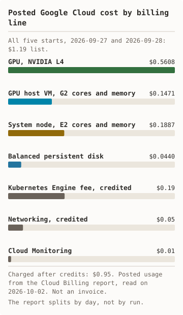
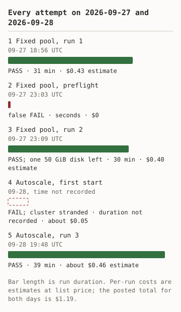

# Measured runs

Each Markdown file here is the receipt of one live run against a real Google
Cloud project. Costs in the receipts are estimates at list prices from the
Cloud Billing Catalog API, with durations as upper bounds.

## Posted cost

<picture><source media="(prefers-color-scheme: dark)" srcset="../diagrams/runs-cost-dark.svg"/></picture> <picture><source media="(prefers-color-scheme: dark)" srcset="../diagrams/runs-attempts-dark.svg"/></picture>

Text version of the diagrams

Posted list cost $1.19 for five starts: L4 GPU $0.5608, G2 host VM $0.1471, E2 system node $0.1887, persistent disk $0.0440, Kubernetes Engine fee $0.19 credited, networking $0.05 credited, Cloud Monitoring $0.01. Charged after credits $0.95.

Five starts. 09-27 18:56 fixed pool run 1 passed in 31 minutes. 09-27 23:03 preflight gave a false fail. 09-27 23:09 fixed pool run 2 passed in 30 minutes and left one 50 GiB disk. 09-28 the first autoscale start failed and stranded a cluster. 09-28 19:48 autoscale run 3 passed in 39 minutes.

The Cloud Billing report for 2026-09-26 to 2026-09-30, read on 2026-10-02,
covers all five starts below. The report groups by service, not by run, so
the receipts keep their per-run estimates.

- **Compute Engine**
  - List cost: $0.94
  - Credits: $0.00
  - Charged: $0.94
- **Kubernetes Engine**
  - List cost: $0.19
  - Credits: -$0.19
  - Charged: $0.00
- **Networking**
  - List cost: $0.05
  - Credits: -$0.05
  - Charged: $0.00
- **Cloud Monitoring**
  - List cost: $0.01
  - Credits: $0.00
  - Charged: $0.01
- **Total**
  - List cost: $1.19
  - Credits: -$0.24
  - Charged: $0.95

The estimates for the same starts sum to about $1.34. They were high by about
$0.15 at list cost, as an upper bound should be. The credit covered the whole
cluster fee, which run 1's receipt had marked as not verified. The estimates
left out networking and monitoring, $0.06 together.

Compute Engine by SKU, same period and report:

- **NVIDIA L4 GPU**
  - Usage: 1.00 hour
  - List cost: $0.5608
- **G2 instance core and RAM**
  - Usage: 4.01 core-hours, 16.03 GiB-hours
  - List cost: $0.1471
- **E2 instance core and RAM**
  - Usage: 5.63 core-hours, 22.54 GiB-hours
  - List cost: $0.1887
- **Balanced persistent disk**
  - Usage: 0.44 GiB-months
  - List cost: $0.0440
- **Compute Engine total**
  - List cost: $0.9406

The L4 was metered for about 60 minutes across all starts. The three receipts
estimated 72.5 minutes in total, as upper bounds. The system node was metered
for about 84 minutes (5.63 core-hours on 4 cores) against 99.7 estimated.
The disk line includes the orphaned disk from run 2.

All services by day, same report:

- **NVIDIA L4 GPU**
  - 09-27 (runs 1 and 2): $0.3398, about 36 min
  - 09-28 (failed start and run 3): $0.2211, about 24 min
- **G2 instance core and RAM**
  - 09-27 (runs 1 and 2): $0.0891
  - 09-28 (failed start and run 3): $0.0580
- **E2 instance core and RAM**
  - 09-27 (runs 1 and 2): $0.1065, about 48 min
  - 09-28 (failed start and run 3): $0.0823, about 37 min
- **Balanced persistent disk**
  - 09-27 (runs 1 and 2): $0.0266
  - 09-28 (failed start and run 3): $0.0174
- **Cloud Monitoring, Prometheus samples**
  - 09-27 (runs 1 and 2): $0.0059
  - 09-28 (failed start and run 3): $0.0042
- **Charged**
  - 09-27 (runs 1 and 2): $0.5678
  - 09-28 (failed start and run 3): $0.3828
- **Zonal cluster fee, credited in full**
  - 09-27 (runs 1 and 2): $0.10, 1.02 hours
  - 09-28 (failed start and run 3): $0.09, 0.86 hours
- **Networking, credited in full**
  - 09-27 (runs 1 and 2): about $0.03
  - 09-28 (failed start and run 3): about $0.03
- **List cost**
  - 09-27 (runs 1 and 2): about $0.70
  - 09-28 (failed start and run 3): about $0.50
- **Receipts' estimates for the day**
  - 09-27 (runs 1 and 2): $0.83
  - 09-28 (failed start and run 3): $0.46, plus the failed start

The day is the finest split the report gives, so runs 1 and 2 cannot be
separated. Minutes are derived from the posted usage. Credited lines are
rounded to the cent in the report.

Against the receipts:

- Runs 1 and 2 estimated 47.9 GPU minutes and were metered for about 36.
- The cluster fee on 09-27 was metered for 61 minutes. The receipts estimated
  61.1.
- Run 3 estimated 24.6 GPU minutes, and the whole of 09-28 was metered for
  about 24. The failed first start used little or no GPU time.
- The cluster fee on 09-28 was metered for 52 minutes against 38.6 for run 3,
  so the stranded cluster from the failed start lived about 13 minutes.

## Run summaries

From the three receipts. Estimates use list prices and upper-bound durations.

### Run 1, fixed pool

| Measure | Value |
|---|---|
| Date | 2026-09-27 |
| Script start to pod Ready | 20 m 19 s |
| Scale-up: pod Pending to GPU node Ready | not applicable |
| Scale-down: zero replicas to no GPU node | not applicable |
| Time to first token, 5 streamed requests | p50 0.29 s, max 0.30 s |
| Output throughput, single stream | p50 15.9 tokens/s, min 15.2 |
| Latency, 20 requests, 256 max tokens, temp 0 | p50 11.1 s, p95 16.0 s |
| Destroy | clean, 6 m 35 s |
| Cost estimate at list price | $0.43 |
| Posted list cost, by day | about $0.70 for runs 1 and 2 together |
| Receipt | [run 1](2026-09-27-run-1-fixed.md) |

### Run 2, fixed pool

| Measure | Value |
|---|---|
| Date | 2026-09-27 |
| Script start to pod Ready | 18 m 53 s |
| Scale-up: pod Pending to GPU node Ready | not applicable |
| Scale-down: zero replicas to no GPU node | not applicable |
| Time to first token, 5 streamed requests | p50 0.19 s, max 0.21 s |
| Output throughput, single stream | p50 15.9 tokens/s, min 15.5 |
| Latency, 20 requests, 256 max tokens, temp 0 | p50 11.1 s, p95 16.1 s |
| Destroy | one 50 GiB disk left, 6 m 39 s |
| Cost estimate at list price | $0.40 |
| Posted list cost, by day | see run 1 |
| Receipt | [run 2](2026-09-27-run-2-fixed.md) |

### Run 3, autoscale 0→1→0

| Measure | Value |
|---|---|
| Date | 2026-09-28 |
| Script start to pod Ready | 16 m 07 s |
| Scale-up: pod Pending to GPU node Ready | 1 m 17 s |
| Scale-down: zero replicas to no GPU node | 12 m 32 s |
| Time to first token, 5 streamed requests | p50 0.19 s, max 0.20 s |
| Output throughput, single stream | p50 15.9 tokens/s, min 15.8 |
| Latency, 20 requests, 256 max tokens, temp 0 | p50 11.1 s, p95 16.0 s |
| Destroy | clean, 5 m 51 s |
| Cost estimate at list price | about $0.46 |
| Posted list cost, by day | about $0.50, with one failed start |
| Receipt | [run 3](2026-09-28-run-3-autoscale.md) |

## Receipts

- [2026-09-27, run 1](2026-09-27-run-1-fixed.md): Fixed, one `g2-standard-4` with one L4. PASS: deploy to Ready 20 m 19 s; destroy clean
- [2026-09-27, run 2](2026-09-27-run-2-fixed.md): Fixed, updated scripts. Deploy and benchmark PASS; destroy FAIL, one disk left
- [2026-09-28, run 3](2026-09-28-run-3-autoscale.md): Autoscale, GPU pool 0 to 1 to 0. PASS: scale-up 1 m 17 s, scale-down 12 m 32 s; destroy clean

## Every attempt, including the failures

Five starts produced the three receipts above. Times are UTC.

- **1. Fixed pool, run 1**
  - Date, start: 09-27, 18:56
  - Duration: 31 min
  - Outcome: PASS
  - Cause: none
  - Fix: none
  - Cost, estimate: $0.43
- **2. Fixed pool, preflight**
  - Date, start: 09-27, 23:03
  - Duration: seconds
  - Outcome: False FAIL on "no existing cluster"; nothing created
  - Cause: `gcloud` prints a warning to stderr when no cluster matches. Preflight read it as a cluster name.
  - Fix: `d78e61c`: read stdout only
  - Cost, estimate: $0
- **3. Fixed pool, run 2**
  - Date, start: 09-27, 23:09
  - Duration: 30 min
  - Outcome: Deploy and benchmark PASS; destroy left one 50 GiB disk
  - Cause: Cleanup deleted the cluster while the pod still held the disk, so the driver could not delete it
  - Fix: `d78e61c`: wait for pods and volumes before the cluster delete. Proven in run 3.
  - Cost, estimate: $0.40, plus the disk at about $0.0068 per hour until deleted
- **4. Autoscale, first start**
  - Date, start: 09-28, time not recorded
  - Duration: not recorded
  - Outcome: FAIL: a closed terminal pane killed the runner and its watchdog together. One cluster was stranded and deleted by hand.
  - Cause: The watchdog ran inside the terminal's process group
  - Fix: `5279c9e`, `057440b`: the watchdog runs in its own session and takes over cleanup
  - Cost, estimate: about $0.05
- **5. Autoscale, run 3**
  - Date, start: 09-28, 19:48
  - Duration: 39 min
  - Outcome: PASS
  - Cause: none
  - Fix: none
  - Cost, estimate: about $0.46

Attempt 4 has no receipt. Its cost is an estimate from the time the cluster
existed. The time the orphaned disk from attempt 3 was deleted is not
recorded, so its cost has no total.

What the failures changed in the kit:

- Cleanup now waits for each volume to go before it deletes the cluster, and
  then checks the project for leftover disks.
- The runner's watchdog survives a closed terminal and a kill of the process
  group. Tests H1, H2, K1, K2, and G1 cover it.
- Preflight reads only stdout from `gcloud`.
